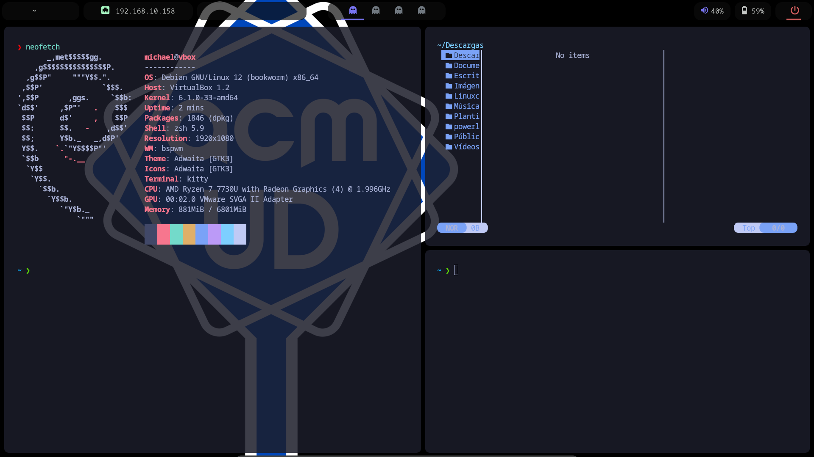
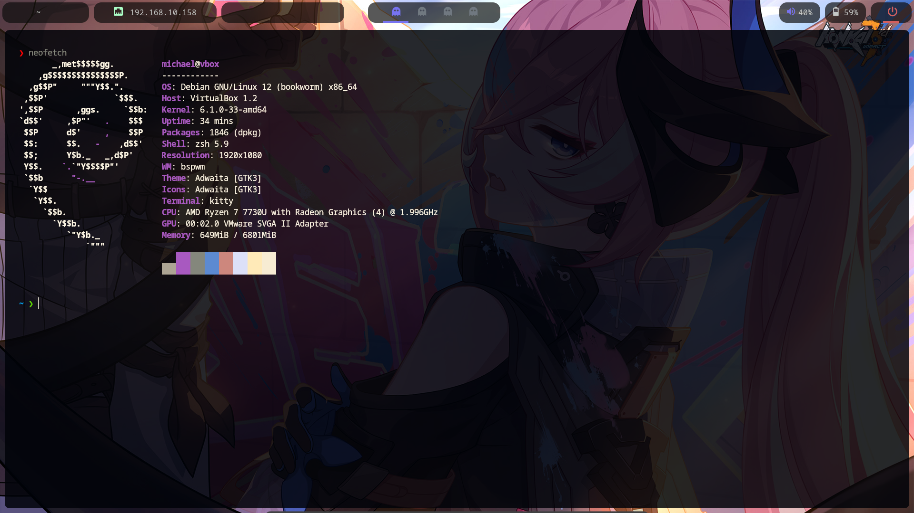

# Auto linux setup

Este script es una forma automática de configurar una distribución basada en debian con bspwm.

En la carpeta compiled encontrará compilaciones recientes de polybar y picom, en caso de que su distribución no tenga una versión reciente.

# Resultados




## Uso

```
cd /tmp/
git clone https://github.com/Michael-Jimenez-C/auto_linux_setup.git
chmod +x install.sh
./install.sh
```

## Recomendaciones

Recomendaría instalar rust para tener wallust y yazi, utilidades que le dan un aspecto muy agradable al entorno.

Para cambiar el fondo de pantalla simplemente puede remplazar la imagen en ``src/background`` antes de instalar o en ``$HOME/.local/share/fondos`` despues de instalar.
